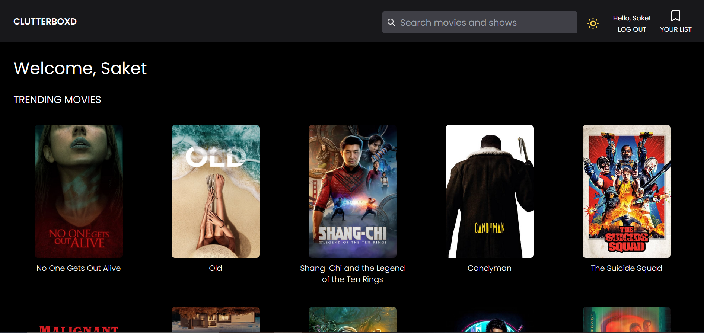
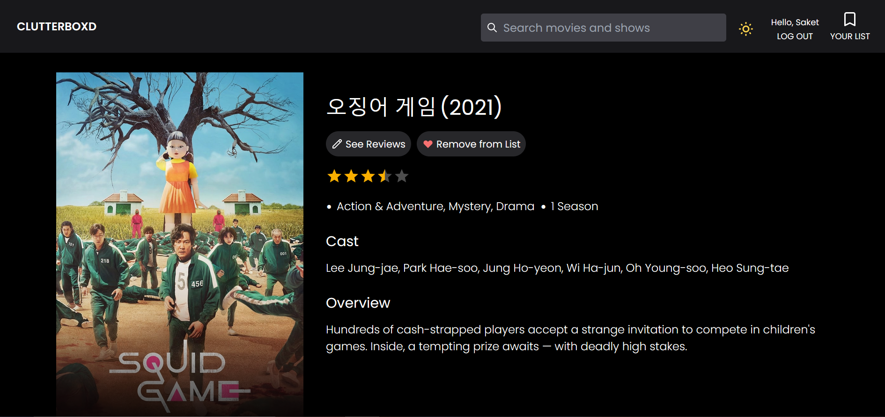
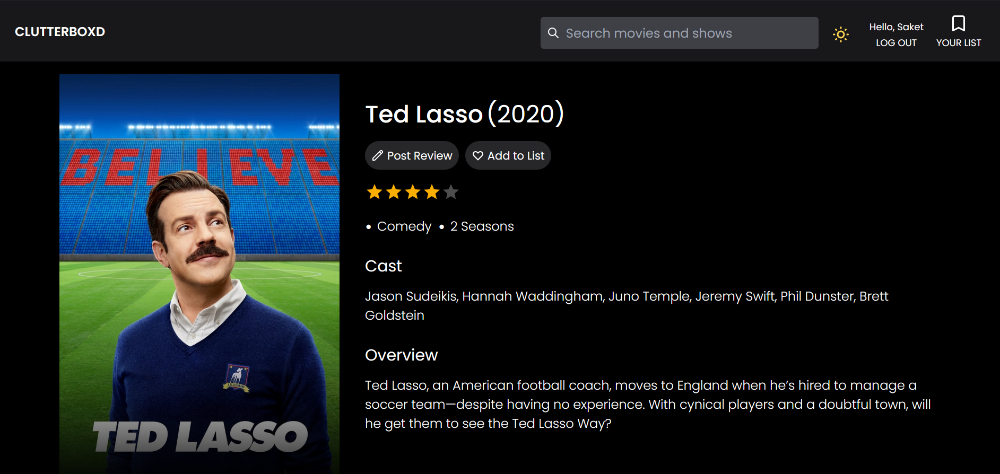
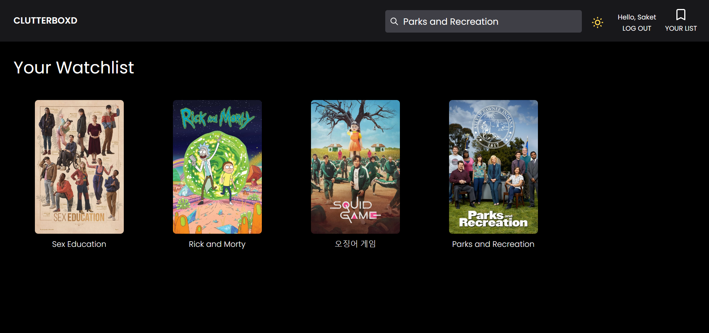

## Clutterboxd - A Letterboxd Clone

[](https://app.netlify.com/sites/netflixwatchlist/deploys)

## Todos

1. [x] Create custom error and Not Found(404) pages.
2. [x] Make fonts/styles consistent across UI.
3. [x] Improve the review form interface.


## Overview

- A movie search app built using React, Node and PostgreSQL.
- You can explore movies and shows trending in your region and add the ones you plan on watching to your watchlist. You can rate and review them too.
- You can also search for a particular movie or show within the site. All data is obtained from TMDB's public API.
- Here is the final production link of the app: [Link](https://netflixwatchlist.netlify.app/)
- The Node/Express/Postgres backend has been deployed to heroku while the react front end has been hosted on netlify.

## Screenshots


<br/> 

<br/>

<br/>

<br/>

## Installation

- Clone and install dependencies locally
```
    git clone https://github.com/saket2508/netflix-watchlist.git
    cd netflix-watchlist
    npm install
    cd server
    npm install
    cd..
    cd client
    npm install
```
- Make sure you have installed Node and Postgres in your system.
- Get your TMDB API credentials and save it in a .env file inside the `client/` directory
- Next, go to [Google Developers](https://developers.google.com/identity/sign-in/web) and create a new project in order to use Google OAuth for signing in users.
- Save your credentials in a .env file inside the `server/` directory.

## Running Locally
- You can start the application in dev mode by running the following command in your terminal.
```
    npm run dev
```
- The server should run on port `localhost:5000` while the client is served on `localhost:3000`
